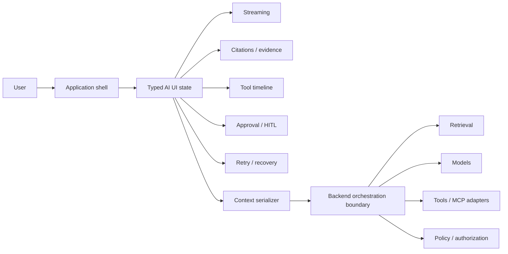

# Architecture Review — Frontend AI Patterns

`frontend-ai-patterns` is the portfolio's **AI interface architecture library**. It is intentionally smaller than a platform: the repo defines reusable contracts, fixtures, patterns and review checklists for trustworthy AI product surfaces.

## Architectural thesis

AI frontend architecture is not a chat-bubble problem. A production interface needs explicit state for streaming, retrieval, tools, approvals, context, failure and recovery.



## Event/state model

A trustworthy interface should be able to represent transitions such as:

```text
idle
  -> thinking
  -> retrieving_context
  -> planning
  -> awaiting_approval
  -> executing_tool
  -> completed

and from any relevant step:
  -> failed
  -> recovering
  -> retry / terminal failure
```

The exact state machine may vary by product, but hidden intermediate states create misleading UX.

## Trust boundary

Frontend patterns can make AI behavior inspectable, but they do **not** replace backend enforcement.

Frontend responsibilities:
- display provenance and confidence/context metadata
- render tool intent and execution status
- collect explicit approval/rejection
- preserve error/recovery state
- serialize only appropriate page context

Backend responsibilities:
- authorization and policy enforcement
- provider secrets
- retrieval access control
- protected tool execution
- audit and durable approval state

## Failure patterns

| Failure | UI architecture requirement |
| --- | --- |
| stream stalls | distinguish active, stalled, retryable and terminal states |
| citation cannot resolve | mark evidence unavailable; do not silently drop provenance |
| tool fails | preserve attempted tool, failure reason and recovery path |
| approval expires | show stale/expired state rather than executing optimistically |
| context is too large/stale | expose context policy/truncation rather than imply full page knowledge |
| backend rejects action | render denial as authoritative |

## Framework strategy

The contracts are designed to be **TypeScript-first and framework-independent**. Angular remains the deepest reference implementation because it is the portfolio's primary enterprise frontend stack. React/Vue examples can demonstrate portability without weakening the Angular specialization.

## What this repo is not

- a model gateway
- a backend agent runtime
- a security enforcement layer
- a monolithic component framework

It is a reference layer for product teams deciding how AI behavior should become explicit, testable frontend state.

## Portfolio role

- `ai-tools-cheatsheets`: learn the AI engineering toolchain.
- `frontend-ai-patterns`: learn and reuse the interaction architecture.
- `angular-ai-copilot-starter`: run the patterns in a focused Angular demo.
- `ngx-copilot-platform`: integrate the concepts into a full-stack platform.
