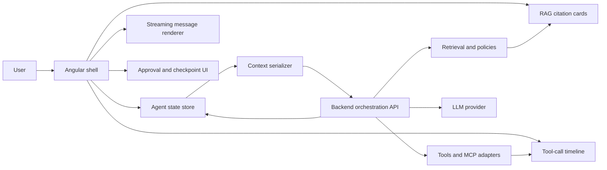

# Frontend AI Patterns

An Angular and TypeScript architecture cookbook for AI product UIs: streaming chat, RAG citations, MCP and tool timelines, approvals, state machines, context serialization, human-in-the-loop flows, retries, and enterprise guardrails.

This repo is for developers building trustworthy AI frontends, not generic chat demos. It focuses on UI contracts, typed models, failure handling, accessibility, and the boundary between frontend behavior and backend orchestration.

## Docs

Live GitHub Pages URL:
[https://ankitparekh007.github.io/frontend-ai-patterns/](https://ankitparekh007.github.io/frontend-ai-patterns/)

Current doc entry points:
- [Architecture Overview](docs/architecture.md)
- [GitHub Pages Plan](docs/github-pages-plan.md)
- [Angular AI Frontend Checklist](docs/angular-ai-frontend-checklist.md)
- [Recruiter Review Guide](RECRUITER_REVIEW_GUIDE.md)
- [What This Proves](WHAT_THIS_PROVES.md)

## Why This Repo Exists

Most AI frontend examples stop at “chat input plus model output.” Real product teams need more:

- streaming states that feel responsive without hiding failure
- citations that make retrieved evidence inspectable
- tool-call UI that exposes intent, status, and results
- approvals for risky actions
- state models that keep agent behavior understandable
- context serialization that avoids leaking sensitive UI data
- enterprise guardrails that align product UX with policy

## Pattern Index

1. [Streaming Message UX](patterns/01-streaming-message-ux.md)
2. [RAG Source Cards](patterns/02-rag-source-cards.md)
3. [Tool-Call Timeline](patterns/03-tool-call-timeline.md)
4. [Action Approval Flow](patterns/04-action-approval-flow.md)
5. [Agent State Machine](patterns/05-agent-state-machine.md)
6. [Context Serializer](patterns/06-context-serializer.md)
7. [MCP Tool UI](patterns/07-mcp-tool-ui.md)
8. [Human In The Loop](patterns/08-human-in-the-loop.md)
9. [Error Recovery And Retry](patterns/09-error-recovery-and-retry.md)
10. [Enterprise Guardrails](patterns/10-enterprise-guardrails.md)

## What You Can Reuse

- typed TypeScript models in [examples/typescript-models/pattern-models.ts](examples/typescript-models/pattern-models.ts)
- Angular-oriented composition notes in [examples/angular/README.md](examples/angular/README.md)
- mock workflow data in [examples/mock-data/README.md](examples/mock-data/README.md)
- pattern-by-pattern implementation checklists under [`patterns/`](patterns)

## Architecture Map

## How To Use The Cookbook

1. Start with [docs/architecture.md](docs/architecture.md).
2. Pick the pattern closest to your current feature.
3. Copy the TypeScript model as a starting contract, not a final standard.
4. Use the Angular implementation notes to decide component, service, and state boundaries.
5. Use the failure, accessibility, and testing sections before you ship.

## Examples

- [Angular examples](examples/angular/README.md)
- [TypeScript model pack](examples/typescript-models/README.md)
- [Mock data fixtures](examples/mock-data/README.md)

## What This Is Not

- not a claim of live production adoption
- not a backend orchestration framework
- not a provider SDK wrapper
- not a mass of UI screenshots without implementation guidance

## Who This Helps

- Angular developers moving into AI product engineering
- TypeScript-heavy frontend teams designing copilot and agent UIs
- architects standardizing RAG, tool, and approval interaction patterns
- contributors who want practical documentation-first open source work
- recruiters and interviewers who need fast, inspectable public proof

## Why Star, Watch, Or Fork

- star it if you want a practical reference for trustworthy AI frontend design
- watch it if you want more Angular-first examples and enterprise interaction patterns
- fork it if you want to adapt the models, diagrams, or mock fixtures to your own copilot UI

## Contributing

Use [CONTRIBUTING.md](CONTRIBUTING.md) and [GOOD_FIRST_ISSUES.md](GOOD_FIRST_ISSUES.md) for scoped starter work. The best contributions are specific: improve one pattern page, add one diagram, add one example, or tighten one testing or accessibility checklist.
