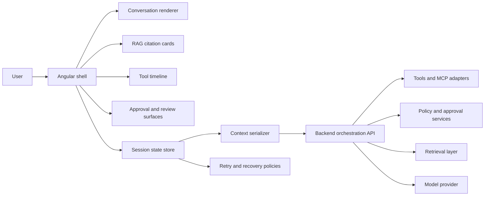

# Frontend AI Patterns

Angular and TypeScript patterns for trustworthy AI frontends. This repo is a reusable reference library for streaming chat, RAG evidence, tool execution UX, approvals, state recovery, and enterprise guardrails.

[Open the live docs site](https://ankitparekh007.github.io/frontend-ai-patterns/) | [Quickstart](docs/quickstart.md) | [Pattern Library](docs/pattern-library.md) | [Examples](docs/examples.md) | [Enterprise Readiness](docs/enterprise-readiness.md)

## Why This Repo Is Worth Forking

- Copy typed contracts for streaming, citations, approvals, recovery, and context state.
- Reuse JSON fixtures for demos, tests, Storybook states, and onboarding.
- Start from Angular composition examples without adopting a full framework.
- Use the starter packs to lift one pattern into your app in under an hour.
- Keep enterprise concerns visible: auditability, approvals, guardrails, accessibility, and failure states.

## What You Can Reuse In Five Minutes

- [Canonical TypeScript contracts](examples/typescript-models/pattern-models.ts)
- [Angular shell composition examples](examples/angular/README.md)
- [Mock fixtures for realistic UI states](examples/mock-data/README.md)
- [Starter packs with contract, fixture, diagram, and checklists](starter-packs/README.md)
- [Decision guides for approvals, tool visibility, citations, and persistence](docs/decision-guides.md)

## Visual Preview

The docs site is organized like a product, not a README mirror:

- `Home`: value proposition, architecture, proof pillars, reuse paths
- `Quickstart`: what to copy, where to start, minimal and production-shaped paths
- `Pattern Library`: grouped patterns with repeatable templates and linked packs
- `Examples`: Angular examples, TypeScript models, mock fixtures, starter packs
- `Enterprise Readiness`: frontend boundaries, approvals, observability, rollout checks
- `Contributing`: contribution standards for high-trust public artifacts

## Architecture Map

## Start Here

1. Read [docs/quickstart.md](docs/quickstart.md) to choose a minimal or production-shaped adoption path.
2. Open [docs/pattern-library.md](docs/pattern-library.md) and pick the pattern closest to your current feature.
3. Copy the related starter pack from [starter-packs/](starter-packs/README.md).
4. Use the Angular and TypeScript example folders to map the contract into UI state and component boundaries.

## Pattern Index

### Conversation UX

1. [Streaming Message UX](patterns/01-streaming-message-ux.md)
2. [Agent State Machine](patterns/05-agent-state-machine.md)

### Retrieval UX

3. [RAG Source Cards](patterns/02-rag-source-cards.md)
4. [Context Serializer](patterns/06-context-serializer.md)

### Tooling UX

5. [Tool-Call Timeline](patterns/03-tool-call-timeline.md)
6. [MCP Tool UI](patterns/07-mcp-tool-ui.md)

### Safety And Control

7. [Action Approval Flow](patterns/04-action-approval-flow.md)
8. [Human In The Loop](patterns/08-human-in-the-loop.md)
9. [Enterprise Guardrails](patterns/10-enterprise-guardrails.md)

### State And Reliability

10. [Error Recovery And Retry](patterns/09-error-recovery-and-retry.md)

## Example Packs

- [Angular examples](examples/angular/README.md)
- [TypeScript model pack](examples/typescript-models/README.md)
- [Mock data fixtures](examples/mock-data/README.md)
- [Starter packs](starter-packs/README.md)

## Enterprise Signal

- [Adoption guide](docs/adoption-guide.md)
- [Comparisons against generic AI chat UI](docs/comparisons.md)
- [Design review checklist](docs/design-review-checklist.md)
- [Threat modeling checklist](docs/threat-modeling-checklist.md)
- [Accessibility checklist](docs/accessibility-checklist.md)
- [Observability checklist](docs/observability-checklist.md)
- [Release strategy](docs/release-strategy.md)

## Compatibility

- Angular: examples are written for modern standalone Angular patterns and signals.
- TypeScript: contracts target strict TypeScript and JSON-serializable UI state.
- Hosting: docs site is static and GitHub Pages-friendly by design.

## What This Repo Is

- a docs-and-assets reference for building serious AI frontend workflows
- a public proof artifact for enterprise-aware Angular and TypeScript engineering
- a reusable source of contracts, fixtures, diagrams, and implementation checklists

## What This Repo Is Not

- a production deployment claim
- a hosted SaaS product
- a backend orchestration framework
- a drop-in UI component library

## Why Star Or Watch

- Star it if you want a high-signal reference for trustworthy AI UI work.
- Fork it if you need copy-pasteable contracts, fixtures, and implementation checklists.
- Watch it if you want the pattern library and examples to keep expanding.

## Contributing

Use [CONTRIBUTING.md](CONTRIBUTING.md), [GOOD_FIRST_ISSUES.md](GOOD_FIRST_ISSUES.md), and the issue templates under [.github/ISSUE_TEMPLATE](.github/ISSUE_TEMPLATE) for scoped work. The best contributions improve one pattern, one starter pack, one example path, or one enterprise checklist at a time.
