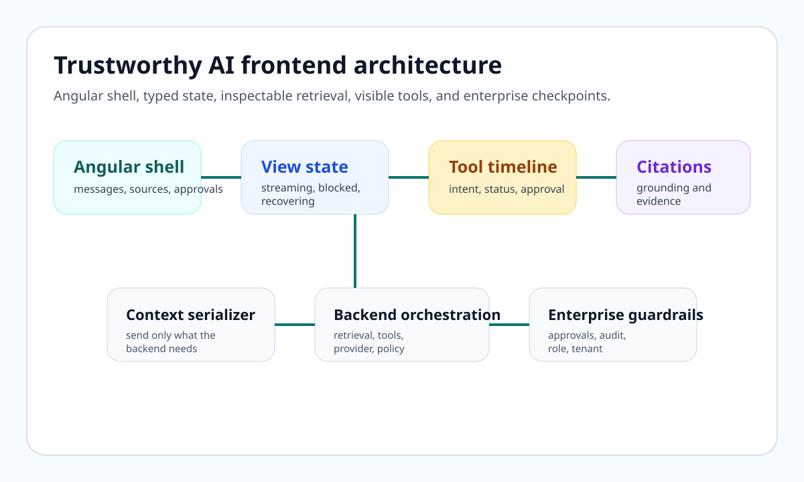
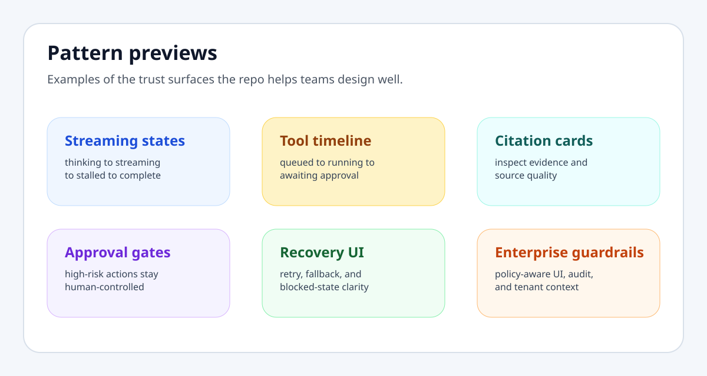
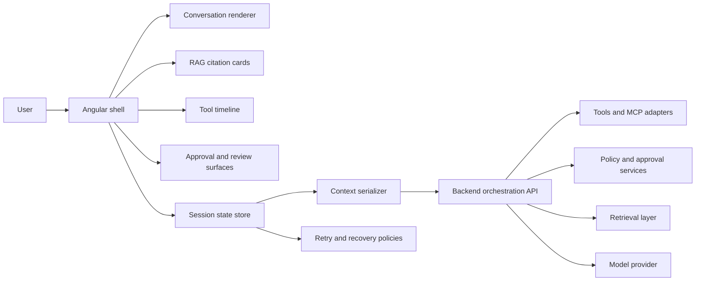

# Frontend AI Patterns

Angular and TypeScript patterns for trustworthy AI frontends. This repo is a fork-friendly reference library for streaming UX, grounded citations, tool execution UI, approval flows, recovery states, and enterprise-safe interaction boundaries.

[Live docs site](https://ankitparekh007.github.io/frontend-ai-patterns/) | [Quickstart](docs/quickstart.md) | [Demo Gallery](docs/demo-gallery.md) | [Use Cases](docs/use-cases.md) | [Pattern Library](docs/pattern-library.md)

## Copy This In Five Minutes

- [TypeScript contracts](examples/typescript-models/pattern-models.ts) for streaming, citations, approvals, retry, and context state
- [JSON fixtures](examples/mock-data/README.md) for demos, reducer tests, screenshots, and Storybook-style previews
- [Angular composition examples](examples/angular/README.md) for shell, store, service, and approval boundaries
- [Starter packs](starter-packs/README.md) that bundle `contract.ts`, `fixture.json`, `diagram.mmd`, `implementation-checklist.md`, and `testing-checklist.md`
- [Demo gallery](docs/demo-gallery.md) that shows the repo’s trust surfaces as product behavior instead of only prose

## Why Developers Fork This Repo

- Fork it to bootstrap a trustworthy AI UI contract layer without inventing message, citation, approval, and retry state from scratch.
- Fork it to seed previews, tests, and demo data with realistic fixtures instead of fake one-line payloads.
- Fork it to standardize visible trust surfaces like tool timelines, approval gates, and grounded citations across products.
- Fork it to turn one pattern into an internal starter pack without taking a monolithic framework.

## What This Repo Proves

- **Streaming UX is a state machine problem**, not just a chat bubble problem.
- **Grounded AI responses need inspectable evidence**, not hidden retrieval.
- **Tool execution should be visible and reviewable**, especially when the action is risky or destructive.
- **Recovery and accessibility are core interaction requirements**, not cleanup tasks after the happy path works.
- **Enterprise-safe AI UI can be documented as contracts, fixtures, diagrams, and checklists**, not only as screenshots.

## Visual Preview

## Start With A Real Need

### Use Cases

- [Internal copilot](docs/use-cases.md#internal-copilot) for policy-aware employee workflows
- [Support agent workspace](docs/use-cases.md#support-agent-workspace) for visible tools and human review
- [Enterprise search](docs/use-cases.md#enterprise-search) for citations, filters, and retrieval trust
- [Approval-heavy operations console](docs/use-cases.md#approval-heavy-operations-console) for risky actions and audit visibility

### Demo Surfaces

- [Streaming states](docs/demo-gallery.md#streaming-states-demo)
- [Tool timeline](docs/demo-gallery.md#tool-timeline-demo)
- [Approval gate](docs/demo-gallery.md#approval-gate-demo)

## Open The Right Surface First

- `Quickstart`: copy one contract, one fixture, or one starter pack in minutes
- `Demo Gallery`: inspect high-signal product behaviors before reading every pattern page
- `Pattern Library`: browse workflow-based patterns with failure modes, accessibility, and tests
- `Examples`: choose between minimal reuse and production-shaped adoption
- `Enterprise Readiness`: pressure-test rollout expectations before shipping

## Architecture Map

## Pattern Index

### Conversation UX

1. [Streaming Message UX](patterns/01-streaming-message-ux.md)
2. [Agent State Machine](patterns/05-agent-state-machine.md)

### Retrieval UX

3. [RAG Source Cards](patterns/02-rag-source-cards.md)
4. [Context Serializer](patterns/06-context-serializer.md)

### Tooling UX

5. [Tool-Call Timeline](patterns/03-tool-call-timeline.md)
6. [MCP Tool UI](patterns/07-mcp-tool-ui.md)

### Safety And Control

7. [Action Approval Flow](patterns/04-action-approval-flow.md)
8. [Human In The Loop](patterns/08-human-in-the-loop.md)
9. [Enterprise Guardrails](patterns/10-enterprise-guardrails.md)

### State And Reliability

10. [Error Recovery And Retry](patterns/09-error-recovery-and-retry.md)

## Reuse Paths

### Minimal Integration Path

1. Copy one contract from `examples/typescript-models/pattern-models.ts`.
2. Copy the matching fixture from `examples/mock-data/`.
3. Use the linked starter-pack checklist to wire the feature into your own reducer, store, or component tree.

### Production-Shaped Path

1. Start from the matching starter pack in `starter-packs/`.
2. Use the shared TypeScript contracts as the public UI state layer.
3. Adapt the Angular examples into your shell, store, and service boundaries.
4. Run the enterprise checklists before rollout.

## Repo Entry Points

- [Examples overview](docs/examples.md)
- [Adoption guide](docs/adoption-guide.md)
- [Comparisons against generic AI chat UI](docs/comparisons.md)
- [Decision guides](docs/decision-guides.md)
- [Design review checklist](docs/design-review-checklist.md)
- [Threat modeling checklist](docs/threat-modeling-checklist.md)
- [Accessibility checklist](docs/accessibility-checklist.md)
- [Observability checklist](docs/observability-checklist.md)

## Compatibility

- Angular: examples are written for standalone Angular and signal-oriented state patterns.
- TypeScript: contracts target strict TypeScript and JSON-serializable UI state.
- Hosting: the docs site is static and GitHub Pages-friendly by design.

## What This Repo Is

- a docs-and-assets reference for production-minded AI frontend work
- a reusable source of contracts, fixtures, diagrams, and implementation checklists
- a public engineering artifact focused on trust, state, and enterprise-safe interaction design

## What This Repo Is Not

- a hosted SaaS product
- a backend orchestration framework
- a drop-in UI component library
- a claim that frontend trust work can replace backend policy enforcement

## Contributing

Start with [CONTRIBUTING.md](CONTRIBUTING.md), [GOOD_FIRST_ISSUES.md](GOOD_FIRST_ISSUES.md), and [.github/ISSUE_TEMPLATE](.github/ISSUE_TEMPLATE). The best contributions improve one starter pack, one example path, one demo surface, or one enterprise checklist at a time.
