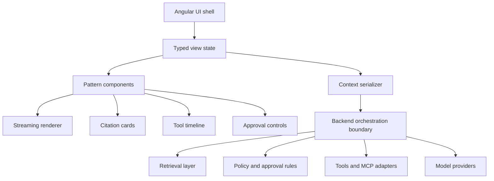

# Architecture Overview

This repo treats AI frontend architecture as a set of cooperating UI contracts rather than one giant “assistant component.”

## Core Layers

## Design Rules

1. The frontend should model user-facing state, not provider internals.
2. Evidence, approvals, and tool activity should be inspectable.
3. Sensitive data should be intentionally serialized, never dumped wholesale.
4. Failures should map to actionable UI states, not vague error toasts.
5. Accessibility is part of correctness for AI interfaces, especially live and changing states.

## Recommended Reading Order

1. [patterns/05-agent-state-machine.md](../patterns/05-agent-state-machine.md)
2. [patterns/01-streaming-message-ux.md](../patterns/01-streaming-message-ux.md)
3. [patterns/02-rag-source-cards.md](../patterns/02-rag-source-cards.md)
4. [patterns/03-tool-call-timeline.md](../patterns/03-tool-call-timeline.md)
5. [patterns/04-action-approval-flow.md](../patterns/04-action-approval-flow.md)
6. [patterns/06-context-serializer.md](../patterns/06-context-serializer.md)
7. [patterns/09-error-recovery-and-retry.md](../patterns/09-error-recovery-and-retry.md)

## Example Pack

- Angular notes: [examples/angular/README.md](../examples/angular/README.md)
- TypeScript models: [examples/typescript-models/pattern-models.ts](../examples/typescript-models/pattern-models.ts)
- Mock fixtures: [examples/mock-data/README.md](../examples/mock-data/README.md)
