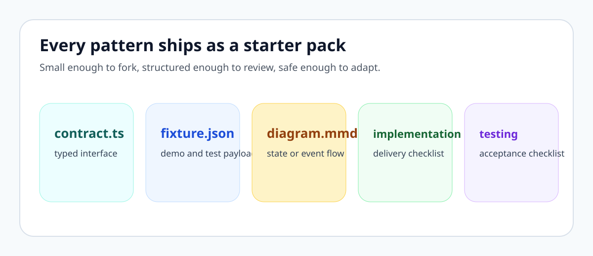

# Frontend AI Patterns

An Angular and TypeScript reference for **trustworthy AI frontend systems**: streaming UX, grounded citations, tool execution visibility, approvals, state coordination, and enterprise guardrails.

## Three proof pillars

| Pillar | Why it matters |
|---|---|
| Streaming UX | Users trust AI systems more when progress, waiting, failure, and recovery are explicit. |
| Tool and approval UX | Developers need patterns for visible tool execution, human checkpoints, and risky-action control. |
| Enterprise guardrails | Real product teams need policy visibility, audit awareness, accessibility, and safe frontend boundaries. |

## Start here

- [Quickstart](quickstart.md): copy one contract, one fixture, or one starter pack in minutes
- [Pattern Library](pattern-library.md): browse patterns grouped by workflow instead of a flat list
- [Examples](examples.md): choose between minimal reuse and production-shaped adoption

## Who this helps

- frontend engineers building copilots, agent workflows, and retrieval-aware interfaces
- Angular teams that want typed, inspectable patterns instead of generic chat demos
- architects standardizing AI interaction contracts across products
- maintainers who want starter-pack style assets that can be forked and adapted safely

## Why fork this repo

- Every major pattern is moving toward a repeatable bundle: `contract`, `fixture`, `diagram`, `implementation checklist`, and `testing checklist`
- The repo includes reusable TypeScript contracts, Angular composition notes, and mock fixtures without pretending to be a production SDK
- The public docs focus on frontend responsibilities: state, accessibility, trust, and orchestration boundaries

## What you can reuse in five minutes

- [`examples/typescript-models/pattern-models.ts`](../examples/typescript-models/pattern-models.ts) for canonical interface starting points
- [`examples/mock-data/`](../examples/mock-data/README.md) for JSON fixtures you can drop into demos or tests
- [`starter-packs/`](../starter-packs/README.md) for pattern-by-pattern bundles
- [`examples/angular/`](../examples/angular/README.md) for Angular shell and state composition examples

## What makes this repo different

- It focuses on **frontend architecture**, not backend orchestration frameworks
- It covers **operator trust surfaces** like approvals, tool timelines, and audit-visible state
- It treats **accessibility and failure handling** as design requirements, not cleanup tasks
- It is intentionally **documentation-first and fork-friendly**, so teams can adopt pieces without taking a monolith
