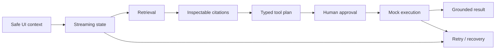

# Trustworthy AI Pattern Playground

A deterministic Angular reference implementation for the full AI frontend lifecycle:

`streaming → retrieval → citations → tool plan → approval → execution → grounded result → failure/retry/recovery`

The playground runs entirely from local fixtures. It requires no provider credentials, never performs real automation, and keeps the production backend enforcement boundary explicit.

## Run Locally

```bash
npm install
npm start
```

Validation:

```bash
npm test
npm run build -- --configuration production
```

## Scenarios

### Grounded flow

Trusted fixture evidence is rendered as citations, a typed tool proposal is shown, execution stops at a human approval gate, and the deterministic mock action runs only after approval.

### No grounded evidence

Retrieval produces no trusted sources. Citations are suppressed, tool planning/execution remain blocked, and the answer states that evidence is missing instead of inventing a grounded response.

### Failed tool

Grounding and approval succeed, but the deterministic tool fixture fails. The UI reports failure accurately and exposes a recovery state rather than claiming success.

### Stalled stream

The assistant stream stalls after safe context serialization. Retry preserves the exact visible-context snapshot and resumes the lifecycle from a clean deterministic boundary.

## What This Proves

- Angular-first AI frontend state modeling
- fixture-driven deterministic demo and test behavior
- visible streaming, retrieval, citation, tool, approval, execution, result, and recovery states
- citation suppression when retrieval is not grounded
- human-in-the-loop execution boundaries
- explicit failed-tool and stalled-stream UX
- safe context serialization rather than hidden-page-state access
- keyboard-accessible native controls and screen-reader announcements
- honest frontend/backend responsibility boundaries

## Architecture



Production systems must enforce retrieval authorization, approval policy, tool execution, provider credentials, idempotency, and audit logging on the backend. The playground only renders deterministic browser fixtures.

## Accessibility

The scenario selector and all runtime controls use native buttons, expose visible focus, and use at least 44px interactive targets. `aria-pressed` identifies the selected fixture and a polite `aria-live` region announces runtime progression, pauses at approval, decisions, retry, and recovery states.

See [docs/pattern-playground.md](docs/pattern-playground.md) for the complete keyboard, screen-reader, scenario, and backend-boundary behavior.

## Source Map

- `src/app/models/playground-scenario.model.ts` — typed scenario, event, citation, and tool contracts
- `src/app/services/playground-scenario.service.ts` — pure deterministic scenario builders + Angular service boundary
- `src/app/pattern-playground/` — interactive Angular reference UI
- `tests/pattern-playground.spec.ts` — grounding, approval, failure, retry, and context-retention tests

The original UI-aware agent components and services remain in the example as additional reference implementations for context serialization, suggested actions, approvals, workflow steps, recovery states, and audit-style logs.

## Contributing

See [CONTRIBUTING.md](../../CONTRIBUTING.md) and [GOOD_FIRST_ISSUES.md](../../GOOD_FIRST_ISSUES.md). High-value contributions add one deterministic scenario, improve accessibility, strengthen state-transition tests, or make the backend boundary easier to review.
