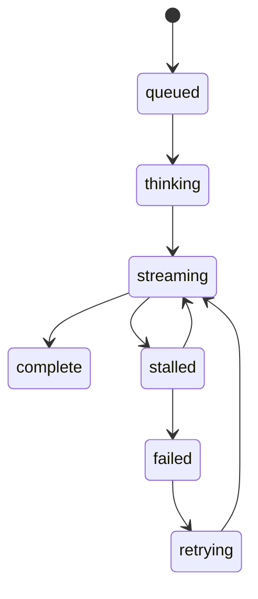

# Streaming Message UX

## Problem

Model output is often slower and less predictable than a normal API response. If the UI waits silently, users assume the system is broken or untrustworthy.

## Why It Matters

Streaming is not only about perceived speed. It exposes progress, makes long answers feel responsive, and gives users a visible distinction between “still generating,” “finished,” and “failed.”

## When To Use

- assistant-style chat threads
- agent explanations that arrive in stages
- long-form answers where partial reading is useful
- workflows where users may need to cancel or retry mid-response

## UX Anatomy

- draft user message enters the thread immediately
- assistant row appears with a loading state before text arrives
- partial chunks append into one visible message
- status label changes from `thinking` to `streaming` to `complete`
- retry and cancel affordances remain close to the active message



## TypeScript Model

```ts
export interface StreamChunk {
  messageId: string;
  sequence: number;
  text: string;
  done: boolean;
}

export interface AssistantMessage {
  id: string;
  role: "assistant";
  content: string;
  status: "streaming" | "complete" | "failed";
}
```

## Angular Implementation Notes

- Reduce incoming chunk events into a single message record in a store or signal graph.
- Render status text in a polite live region so screen reader users hear transitions.
- Keep message identity stable while content changes to avoid DOM thrash.
- Separate “transport connected” from “message complete” so the UI does not imply success too early.

## Failure States

- no first token arrives after the assistant row renders
- chunks arrive out of order
- transport disconnects mid-sentence
- a retry starts but appends to the wrong message id
- the user leaves the route during an active stream

## Accessibility Checklist

- Announce `thinking`, `streaming`, and `complete` state changes.
- Do not rely on typing animation alone to communicate activity.
- Ensure retry and cancel controls are keyboard reachable.
- Preserve focus when the message list grows.

## Testing Checklist

- reducer test for ordered chunk assembly
- test that `done: true` marks the message complete
- test stalled timeout behavior
- test retry creates a fresh stream session
- test screen reader status text for active generation

## Recruiter Talking Points

- Shows understanding of partial event rendering instead of simple request-response UI.
- Demonstrates separation between transport events and user-facing message state.
- Surfaces accessibility and failure handling as architecture concerns, not cleanup work.
