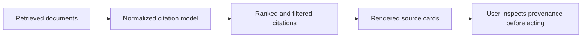

# RAG Source Cards

## Problem

RAG answers lose credibility when supporting evidence is hidden or difficult to inspect.

## Why It Matters

Citation UI turns retrieval from a backend detail into a user trust feature. It helps users verify claims, understand provenance, and decide whether the answer is strong enough to act on.

## When To Use

- support copilots with policy or knowledge-base grounding
- enterprise search experiences
- regulated workflows where evidence matters more than fluency
- any feature that presents retrieved facts as if they are authoritative

## UX Anatomy

- source cards appear adjacent to the answer, not buried in a separate page
- each card shows title, snippet, source type, and confidence indicator
- users can inspect evidence without losing conversational context
- weak or missing citations are visible, not hidden



## TypeScript Model

```ts
export interface RagCitation {
  id: string;
  title: string;
  sourceType: "policy" | "knowledge_base" | "document" | "ticket";
  snippet: string;
  confidence: number;
  url?: string;
}
```

## Angular Implementation Notes

- Keep citation models separate from raw message models so cards can be reused outside chat.
- Normalize backend citation payloads before binding them in templates.
- Use compact card layouts on mobile and expandable snippets on desktop.
- If confidence is shown, pair the number with a textual label such as `high relevance`.

## Failure States

- answer renders but citations never arrive
- citation order changes between retries and confuses users
- snippets are too long and drown out the answer
- low-confidence cards are presented without caution
- broken source URLs create dead-end review flows

## Accessibility Checklist

- Expose source cards as a labeled list.
- Make each title or document action focusable and descriptive.
- Avoid color-only confidence indicators.
- Truncate long snippets carefully and provide an expand affordance.

## Testing Checklist

- test citation normalization from backend payloads
- test confidence label formatting
- test missing URL behavior
- test layout with zero, one, and many sources
- test keyboard navigation across citations

## Recruiter Talking Points

- Shows understanding that RAG UX is an evidence experience, not just a retrieval system.
- Demonstrates how frontend design affects trust in model-generated answers.
- Highlights practical Angular concerns like normalization, layout density, and mobile behavior.
