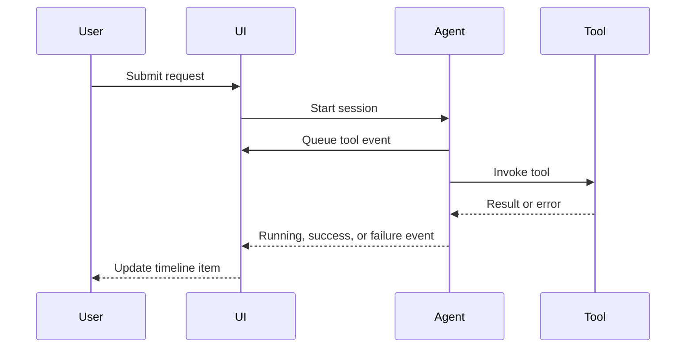

# Tool-Call Timeline

## Problem

When an agent uses tools invisibly, users cannot tell what happened, what is pending, or what failed.

## Why It Matters

Tool transparency reduces confusion and creates an audit-friendly interaction model. It is especially important in enterprise settings where tool actions may affect real systems or records.

## When To Use

- agents that search, mutate, or trigger backend workflows
- MCP-style tool integrations
- product surfaces where plan and execution should be reviewable
- debugging and operator-facing copilots

## UX Anatomy

- each tool call becomes a visible timeline item
- items expose status, summary, timestamps, and approval requirements
- users can distinguish queued, running, approved, failed, retried, and skipped steps
- follow-up actions such as retry or inspect details live at the timeline level



## TypeScript Model

```ts
export interface ToolTimelineItem {
  id: string;
  toolName: string;
  status:
    | "queued"
    | "running"
    | "awaiting_approval"
    | "succeeded"
    | "failed"
    | "skipped"
    | "retried";
  summary: string;
  startedAt?: string;
  finishedAt?: string;
}
```

## Angular Implementation Notes

- Model timeline items as immutable event snapshots, not mutable DOM state.
- Use a dedicated component so tool logic does not leak into the message thread template.
- Group low-value internal steps if the raw tool event stream is too noisy.
- Keep detailed payload inspection behind a disclosure to preserve readability.

## Failure States

- duplicate tool events produce duplicate rows
- a running state never transitions to completion
- approval-gated tools appear as if they already executed
- raw payloads expose internal details that users should not see
- long tool chains overwhelm narrow viewports

## Accessibility Checklist

- Use list semantics or timeline semantics consistently.
- Provide text labels for all statuses.
- Ensure expanded details can be opened without a pointer device.
- Preserve readable order on mobile layouts.

## Testing Checklist

- test timeline ordering
- test status transitions
- test approval-gated tool rendering
- test hidden-details disclosure state
- test compact mobile summary rendering

## Recruiter Talking Points

- Demonstrates how agent tooling becomes understandable in the UI layer.
- Shows awareness of auditability and operator workflows.
- Moves beyond chat UX into orchestration transparency.

## Copy-Paste Starter Assets

- [contract.ts](../starter-packs/03-tool-call-timeline/contract.ts)
- [fixture.json](../starter-packs/03-tool-call-timeline/fixture.json)
- [diagram.mmd](../starter-packs/03-tool-call-timeline/diagram.mmd)
- [implementation checklist](../starter-packs/03-tool-call-timeline/implementation-checklist.md)
- [testing checklist](../starter-packs/03-tool-call-timeline/testing-checklist.md)
