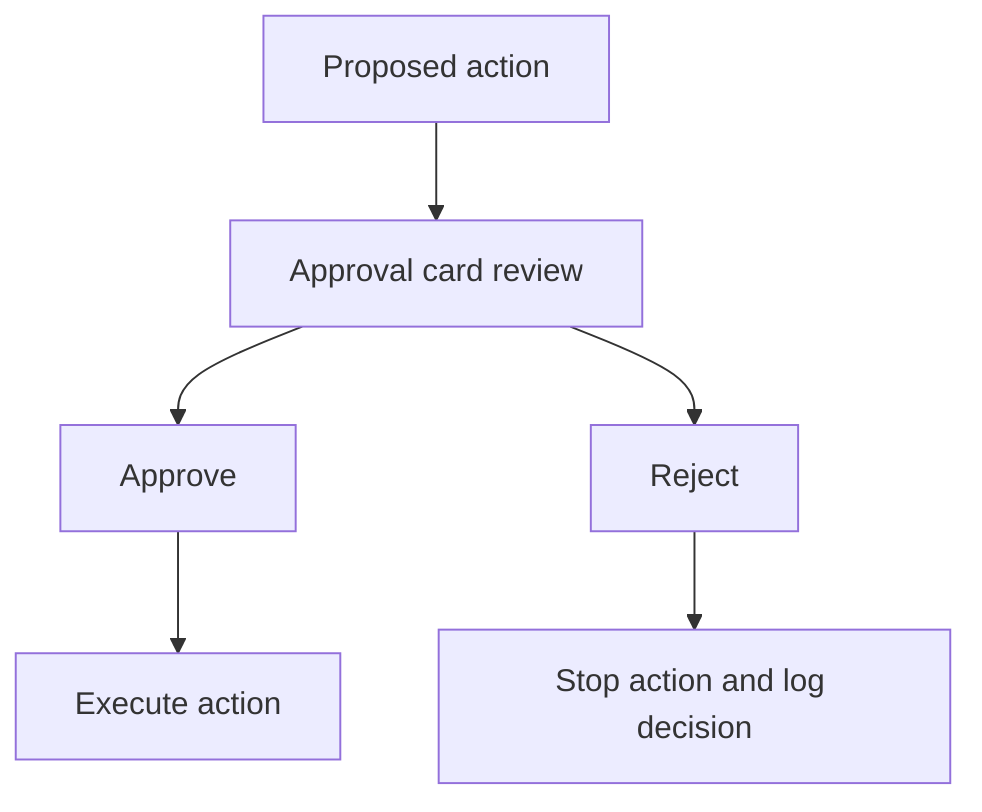

# Action Approval Flow

## Problem

AI systems should not perform risky mutations silently, especially when the user may not fully understand the impact.

## Why It Matters

Approval UX establishes a clear human checkpoint. It protects the user, reduces accidental automation, and makes the boundary between “suggested” and “executed” explicit.

## When To Use

- production actions that change data or infrastructure
- external communications or irreversible workflows
- actions requiring policy or role-based authorization
- any tool call where a preview is safer than direct execution

## UX Anatomy

- approval card explains the action in plain language
- risk level and affected target are visible
- approve and reject are explicit, not hidden in a menu
- decision outcome persists in the timeline or audit feed



## TypeScript Model

```ts
export interface ApprovalRequest {
  id: string;
  title: string;
  riskLevel: "low" | "medium" | "high";
  reason: string;
  actionSummary: string;
  decision?: "approved" | "rejected";
}
```

## Angular Implementation Notes

- Emit explicit approve and reject events instead of letting parent components infer intent.
- Treat approval cards as part of workflow state, not ephemeral modal state only.
- Distinguish between `awaiting approval`, `approved`, and `executed` so the UI stays truthful.
- Consider inline cards first; use modals only when users need more context.

## Failure States

- action executes before the UI decision returns
- approval state disappears after navigation
- risk level is vague or purely color-based
- approval buttons remain active after a decision is submitted
- users cannot see what record or system will change

## Accessibility Checklist

- Make the approval request title a clear heading.
- Pair risk colors with text labels.
- Ensure decision buttons have distinct, descriptive labels.
- Preserve focus when the card appears or resolves.

## Testing Checklist

- test approve and reject event emission
- test idempotent decision handling
- test decision persistence in parent state
- test high-risk copy rendering
- test keyboard activation and focus recovery

## Recruiter Talking Points

- Shows understanding of human-in-the-loop safety in the UI, not just policy theory.
- Demonstrates careful thinking about action previews, confirmation, and auditability.
- Useful evidence for enterprise copilot or agent interface work.
