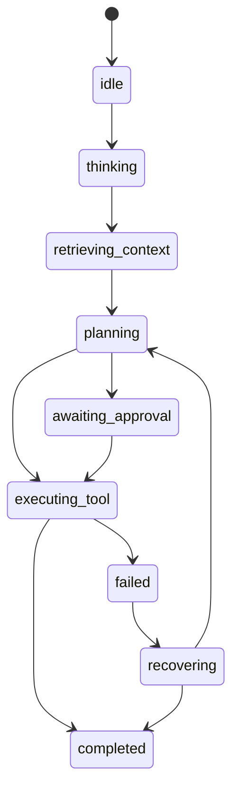

# Agent State Machine

## Problem

AI UIs become brittle when state is inferred from scattered booleans like `isLoading`, `isExecuting`, and `hasError`.

## Why It Matters

An explicit state model makes the UI easier to test, easier to debug, and more honest about what the agent is doing. It also becomes the backbone for streaming, citations, tools, approvals, and recovery.

## When To Use

- any multi-step assistant or agent interface
- flows where retrieval, planning, approval, or execution are distinct
- UIs that need operator visibility or audit-friendly behavior
- frontends that must recover cleanly from partial failures

## UX Anatomy

- one visible top-level session state
- nested surfaces such as timeline or citations react to that state
- transitions are event-driven, not ad hoc template logic
- terminal states are explicit: `completed` and `failed`



## TypeScript Model

```ts
export type AgentViewState =
  | "idle"
  | "thinking"
  | "retrieving_context"
  | "planning"
  | "awaiting_approval"
  | "executing_tool"
  | "completed"
  | "failed"
  | "recovering";
```

## Angular Implementation Notes

- Keep the state machine in a reducer, store, or signal-driven service rather than inside a component.
- Derive view booleans such as `showRetry` or `showApprovalCard` from the state, not the reverse.
- Use timeline or message events to drive transitions instead of direct DOM actions.
- Document which backend events are allowed to transition which states.

## Failure States

- invalid transitions such as `idle` directly to `completed`
- state never resets between sessions
- child components disagree about the current state
- one failure path bypasses recovery logic
- template booleans drift from reducer truth

## Accessibility Checklist

- Expose major state changes through text and status regions.
- Avoid rapid flicker between adjacent states.
- Ensure terminal states have clear summaries.
- Keep recovery actions keyboard reachable.

## Testing Checklist

- transition table tests
- invalid transition tests
- state reset tests
- derived selector tests
- fixture tests for common event sequences

## Recruiter Talking Points

- Shows maturity in modeling AI UX as a state system rather than a demo component.
- Connects architecture quality directly to testability and reliability.
- Provides strong material for system design conversations.
