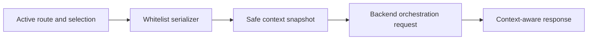

# Context Serializer

## Problem

AI features need application context, but naïvely serializing the entire page leaks sensitive, irrelevant, or unstable UI data.

## Why It Matters

Context serialization is the contract between frontend state and backend orchestration. A good serializer improves relevance while protecting privacy and reducing prompt noise.

## When To Use

- copilots embedded inside complex enterprise pages
- assistants that need route, selection, and visible field context
- any app where UI state should influence orchestration decisions
- systems with role or tenant-specific behavior

## UX Anatomy

- user asks a question from a specific page
- frontend snapshots safe context
- snapshot is sent with the request
- backend uses only the allowed fields
- the UI can explain what context shaped the answer if needed



## TypeScript Model

```ts
export interface UiContextSnapshot {
  route: string;
  selectedRecordId?: string;
  actorRole?: string;
  visibleFields: string[];
  tenantId?: string;
}
```

## Angular Implementation Notes

- Build the serializer as a dedicated service with an explicit whitelist.
- Pull from router state, selected entities, and visible-field metadata instead of arbitrary component internals.
- Keep serialization synchronous and predictable so requests are debuggable.
- Log or surface the snapshot in development builds to catch accidental leakage.

## Failure States

- sensitive hidden fields leak into the prompt context
- snapshots differ between identical screens due to unstable ordering
- route changes race with request creation
- context is too thin and makes answers irrelevant
- context is too large and hurts model quality

## Accessibility Checklist

- If user-visible context chips are shown, ensure labels are readable and keyboard focusable.
- Avoid overwhelming users with raw JSON dumps in the main workflow.
- Keep context disclosures optional but discoverable.
- Use plain language if you expose “what the assistant used” to users.

## Testing Checklist

- whitelist serializer tests
- hidden-field exclusion tests
- route snapshot tests
- stable ordering tests
- tenant and role inclusion tests

## Recruiter Talking Points

- Demonstrates understanding of safe frontend-to-backend contracts.
- Shows that prompt quality depends on UI architecture, not only model choice.
- Useful for enterprise and privacy-sensitive product discussions.
