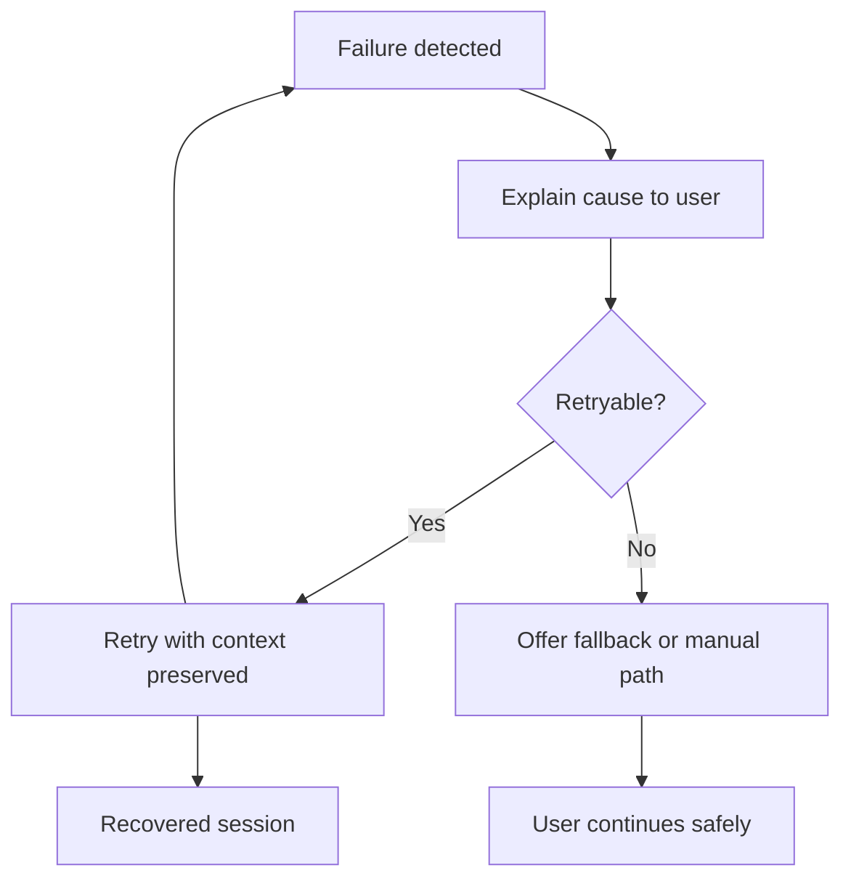

# Error Recovery And Retry

## Problem

AI workflows fail in many ways: provider timeouts, bad tool inputs, policy blocks, retrieval misses, and user context issues.

## Why It Matters

A good recovery experience protects trust. Users do not need perfect systems; they need clear explanations, sensible retry options, and safe fallback paths.

## When To Use

- any production-facing AI workflow
- multi-step agent flows with external dependencies
- operator tools where diagnosis matters
- user-facing copilots where failure must be understandable

## UX Anatomy

- failure is named, not hidden behind a generic toast
- retryability is explicit
- fallback or next-best action is offered
- recovered flows return to a truthful state instead of silently restarting



## TypeScript Model

```ts
export interface RecoveryPlan {
  id: string;
  cause: string;
  retryable: boolean;
  nextStep: string;
  fallbackLabel?: string;
}
```

## Angular Implementation Notes

- Model recovery as a first-class panel or state, not an afterthought.
- Preserve enough session context so retry can be meaningful without replay bugs.
- Keep user-facing cause summaries separate from raw backend error payloads.
- Consider whether retry should repeat the same step or branch to a safer alternative.

## Failure States

- retry button loops forever with no changed context
- raw internal errors leak into the UI
- fallback path is missing for non-retryable failures
- state resets too aggressively and loses user trust
- timeline or citations remain stale after recovery

## Accessibility Checklist

- Explain failures in plain language.
- Make retry and fallback controls obvious and keyboard accessible.
- Avoid overwhelming screen reader users with repeated live-region alerts.
- Ensure resolved failures no longer dominate the reading order.

## Testing Checklist

- retryable versus non-retryable rendering tests
- preserved-context retry tests
- stale-state cleanup tests
- fallback button visibility tests
- user-facing error summary formatting tests

## Recruiter Talking Points

- Shows realistic thinking about operational failure, not only happy-path demo UX.
- Connects trust directly to recovery design.
- Useful proof for production-minded frontend roles.

## Copy-Paste Starter Assets

- [contract.ts](../starter-packs/09-error-recovery-and-retry/contract.ts)
- [fixture.json](../starter-packs/09-error-recovery-and-retry/fixture.json)
- [diagram.mmd](../starter-packs/09-error-recovery-and-retry/diagram.mmd)
- [implementation checklist](../starter-packs/09-error-recovery-and-retry/implementation-checklist.md)
- [testing checklist](../starter-packs/09-error-recovery-and-retry/testing-checklist.md)
